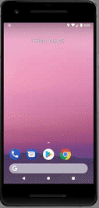

## Este é um projeto para demonstração de conhecimento.

### Técnologias utilizadas

- Backend
    - .Net Core 2.2
    - SQLServer
    - Entity Framework  Core
    - Azure
    - FluentValidador
- Mobile
    - Flutter
- Crawler
    - Python
    - Requests
    - Beaultifulsoup 4

### Demonstração do aplicativo

